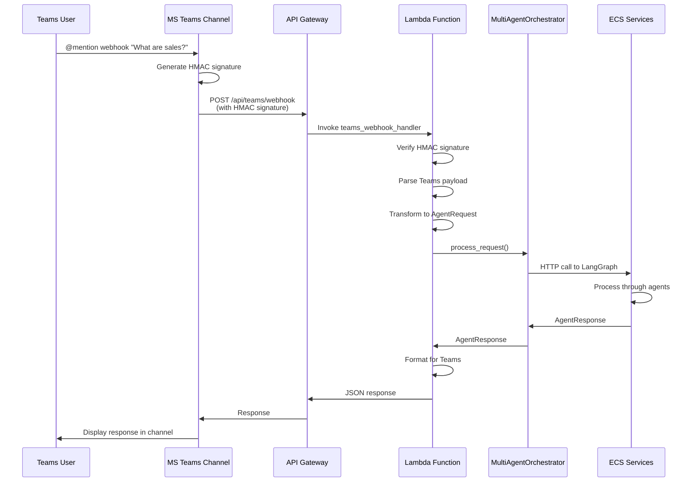

# Microsoft Teams Outgoing Webhook Integration Guide

Complete step-by-step guide for integrating Microsoft Teams Outgoing Webhooks with AWS API Gateway and Lambda functions.

## Table of Contents

1. [Overview](#overview)
2. [Architecture](#architecture)
3. [Prerequisites](#prerequisites)
4. [Step 1: Configure Microsoft Teams Outgoing Webhook](#step-1-configure-microsoft-teams-outgoing-webhook)
5. [Step 2: Deploy AWS API Gateway](#step-2-deploy-aws-api-gateway)
6. [Step 3: Configure Lambda Function](#step-3-configure-lambda-function)
7. [Step 4: Configure HMAC Signature Verification](#step-4-configure-hmac-signature-verification)
8. [Step 5: Test Integration](#step-5-test-integration)
9. [Testing with Postman](#testing-with-postman)
10. [Troubleshooting](#troubleshooting)

---

## Overview

Microsoft Teams Outgoing Webhooks allow users to @mention a webhook in a Teams channel, which sends HTTP POST requests to your configured endpoint. This guide shows how to integrate Teams webhooks with AWS API Gateway and Lambda to process queries through the multi-agent orchestrator.

### Key Features

- **Natural Language Queries**: Users @mention webhook in Teams channels
- **HMAC Security**: Webhook requests verified using HMAC SHA256 signatures
- **Serverless Architecture**: AWS Lambda + API Gateway for automatic scaling
- **Multi-Agent Routing**: Automatically routes to appropriate Snowflake Cortex AI agents
- **Error Handling**: User-friendly error messages in Teams

---

## Architecture

### Complete Integration Flow



### Component Architecture

```
┌─────────────────────────────────────────────────────────────┐
│  Microsoft Teams Channel                                    │
│  User @mentions webhook: "@MultiAgentBot What are sales?"  │
└───────────────────────┬─────────────────────────────────────┘
                        │
                        │ HTTPS POST
                        │ POST /api/teams/webhook
                        │ Headers: Authorization: Bearer <HMAC>
                        ▼
┌─────────────────────────────────────────────────────────────┐
│  AWS API Gateway (HTTP API v2)                              │
│  Route: POST /api/teams/webhook                             │
│  Integration: AWS_PROXY → Lambda                            │
└───────────────────────┬─────────────────────────────────────┘
                        │
                        │ Lambda Invoke
                        ▼
┌─────────────────────────────────────────────────────────────┐
│  AWS Lambda: teams_webhook_handler                          │
│  ┌──────────────────────────────────────────────────────┐  │
│  │  1. Verify HMAC signature                            │  │
│  │  2. Parse Teams webhook payload                       │  │
│  │  3. Transform to AgentRequest                        │  │
│  │  4. Call MultiAgentOrchestrator                     │  │
│  │  5. Format response for Teams                        │  │
│  └───────────────────┬──────────────────────────────────┘  │
└───────────────────────┼─────────────────────────────────────┘
                        │
                        │ AgentRequest
                        ▼
┌─────────────────────────────────────────────────────────────┐
│  MultiAgentOrchestrator                                     │
│  → LangGraph Supervisor                                      │
│  → Snowflake Cortex Agents                                   │
└───────────────────────┬─────────────────────────────────────┘
                        │
                        │ AgentResponse
                        ▼
┌─────────────────────────────────────────────────────────────┐
│  Lambda: Format Response                                    │
│  Returns: {"text": "Response message"}                      │
└───────────────────────┬─────────────────────────────────────┘
                        │
                        ▼
┌─────────────────────────────────────────────────────────────┐
│  Microsoft Teams Channel                                    │
│  Displays response message                                   │
└─────────────────────────────────────────────────────────────┘
```

---

## Prerequisites

### 1. Microsoft Teams Access

- **Teams Admin Permissions**: To create outgoing webhooks in Teams
- **Or Channel Owner**: Channel owner can create webhooks for their channel
- **Teams Account**: Active Microsoft Teams account

### 2. AWS Account Setup

- **AWS Account**: Active AWS account with appropriate permissions
- **AWS CLI**: Configured with credentials
- **Access to**:
  - API Gateway (HTTP API v2)
  - Lambda
  - CloudWatch Logs
  - IAM (for roles and permissions)

### 3. Application Requirements

- **Lambda Function**: `teams_webhook_handler` deployed
- **API Gateway**: HTTP API created
- **Environment Variables**: Webhook secret configured

### 4. Security Token

- **Webhook Secret**: Security token from Teams (generated when creating webhook)
- **Storage**: AWS Secrets Manager or Lambda environment variables

---

## Step 1: Configure Microsoft Teams Outgoing Webhook

### Step 1.1: Navigate to Teams Channel

1. **Open Microsoft Teams**
   - Launch Microsoft Teams application or web app
   - Navigate to the channel where you want to add the webhook

2. **Access Channel Settings**
   - Click **"..."** (three dots) next to channel name
   - Select **"Connectors"** from the menu

### Step 1.2: Create Outgoing Webhook

1. **Find Outgoing Webhook**
   - In the Connectors page, search for **"Outgoing Webhook"**
   - Click **"Configure"** button

2. **Configure Webhook**
   - **Name**: `Multi-Agent Orchestrator` (or your preferred name)
   - **Description**: `AI-powered data query bot for multi-agent orchestrator`
   - **Callback URL**: `https://your-api-gateway-url.execute-api.region.amazonaws.com/prod/api/teams/webhook`
     - ⚠️ **Important**: Must be HTTPS
     - Replace with your actual API Gateway URL
   - **Description for users**: `Ask questions about your data using natural language`

3. **Create Webhook**
   - Click **"Create"** button
   - **⚠️ IMPORTANT**: Copy the **Security Token** immediately
     - This is your webhook secret for HMAC verification
     - Format: Long alphanumeric string (e.g., `AbCdEf123456...`)
     - You cannot view this again after leaving the page

### Step 1.3: Save Security Token

**Store the security token securely:**

```bash
# Option 1: Save to environment variable (for testing)
export TEAMS_WEBHOOK_SECRET="your-security-token-here"

# Option 2: Store in AWS Secrets Manager (recommended for production)
aws secretsmanager create-secret \
  --name multi-agent-orchestrator/teams-webhook-secret \
  --secret-string "your-security-token-here" \
  --region us-east-1
```

**⚠️ Security Note:**
- Never commit the security token to version control
- Use AWS Secrets Manager for production
- Rotate tokens periodically

### Step 1.4: Test Webhook in Teams

1. **@mention the Webhook**
   - In the Teams channel, type: `@Multi-Agent Orchestrator What are the total sales?`
   - Press Enter

2. **Verify Request Sent**
   - Check API Gateway logs (CloudWatch)
   - Check Lambda logs for incoming request

---

## Step 2: Deploy AWS API Gateway

### Step 2.1: Create HTTP API (Using AWS Console)

1. **Navigate to API Gateway**
   - AWS Console → Services → API Gateway
   - Click **"Create API"**

2. **Select API Type**
   - Choose **"HTTP API"**
   - Click **"Build"**

3. **Configure API**
   - **API name**: `multi-agent-orchestrator-api`
   - **Description**: `Multi-Agent Orchestrator API Gateway`
   - Click **"Next"**

4. **Configure Routes**
   - Click **"Add integration"**
   - **Integration type**: `Lambda function`
   - **Lambda function**: Select `multi-agent-orchestrator-teams-webhook-handler`
   - **Route**: `POST /api/teams/webhook`
   - Click **"Next"**

5. **Configure Stage**
   - **Stage name**: `prod` (or `dev`, `staging`)
   - **Auto-deploy**: Enable
   - Click **"Next"**

6. **Review and Create**
   - Review configuration
   - Click **"Create"**

### Step 2.2: Configure CORS (Optional but Recommended)

1. **Navigate to API Settings**
   - API Gateway → Your API → **"CORS"** tab

2. **Configure CORS**
   - **Allow origins**: `*` (or specific domains)
   - **Allow methods**: `POST, OPTIONS`
   - **Allow headers**: `Content-Type, Authorization, X-Teams-Signature`
   - Click **"Save"**

### Step 2.3: Get API Gateway URL

1. **Copy Invoke URL**
   - API Gateway → Your API → **"Stages"** → Select stage
   - Copy the **"Invoke URL"**
   - Format: `https://abc123.execute-api.us-east-1.amazonaws.com/prod`

2. **Full Webhook URL**
   - Complete URL: `https://abc123.execute-api.us-east-1.amazonaws.com/prod/api/teams/webhook`
   - Use this in Teams webhook configuration (Step 1.2)

### Step 2.4: Configure Lambda Permission

API Gateway needs permission to invoke Lambda:

1. **Navigate to Lambda Function**
   - Lambda Console → Functions → `multi-agent-orchestrator-teams-webhook-handler`
   - Go to **"Configuration"** → **"Permissions"**

2. **Add Resource-Based Policy**
   - Click **"Add permissions"** → **"Create policy"**
   - **Policy statement**:
     ```json
     {
       "Effect": "Allow",
       "Principal": {
         "Service": "apigateway.amazonaws.com"
       },
       "Action": "lambda:InvokeFunction",
       "Resource": "arn:aws:lambda:region:account:function:function-name",
       "Condition": {
         "ArnLike": {
           "aws:SourceArn": "arn:aws:execute-api:region:account:api-id/*/*"
         }
       }
     }
     ```

**Or use AWS CLI:**
```bash
aws lambda add-permission \
  --function-name multi-agent-orchestrator-teams-webhook-handler \
  --statement-id AllowExecutionFromAPIGateway \
  --action lambda:InvokeFunction \
  --principal apigateway.amazonaws.com \
  --source-arn "arn:aws:execute-api:region:account:api-id/*/*"
```

---

## Step 3: Configure Lambda Function

### Step 3.1: Create Lambda Function (If Not Exists)

1. **Navigate to Lambda Console**
   - AWS Console → Services → Lambda
   - Click **"Create function"**

2. **Choose Authoring Option**
   - Select **"Author from scratch"**

3. **Basic Information**
   - **Function name**: `multi-agent-orchestrator-teams-webhook-handler`
   - **Runtime**: `Python 3.11`
   - **Architecture**: `x86_64`
   - Click **"Create function"**

### Step 3.2: Upload Deployment Package

1. **Navigate to Code Tab**
   - In the function page, go to **"Code"** tab
   - Click **"Upload from"** → **".zip file"**

2. **Upload ZIP File**
   - Select `teams_webhook_handler.zip` (created from deployment package)
   - Click **"Save"**

**Note**: See [Lambda Configuration Guide](./LAMBDA_CONFIGURATION_GUIDE.md) for creating deployment packages.

### Step 3.3: Configure Basic Settings

1. **Navigate to Configuration**
   - Click **"Configuration"** tab → **"General configuration"** → **"Edit"**

2. **Configure Settings**
   - **Description**: `Microsoft Teams outgoing webhook handler`
   - **Timeout**: `30 seconds` (Teams requires response within 10 seconds, but allow buffer)
   - **Memory**: `512 MB`
   - **Ephemeral storage**: `512 MB`

3. **Save Changes**
   - Click **"Save"**

**Important**: Teams webhooks have a 10-second timeout, but set Lambda timeout to 30 seconds to allow for processing time.

### Step 3.4: Configure Handler

1. **Navigate to Runtime Settings**
   - **Code** tab → **"Runtime settings"** → **"Edit"**

2. **Set Handler**
   - **Handler**: `aws_agent_core.lambda_handlers.teams_webhook_handler.lambda_handler`
   - **Runtime**: `Python 3.11` (should already be set)

3. **Save Changes**
   - Click **"Save"**

### Step 3.5: Configure Environment Variables

1. **Navigate to Environment Variables**
   - **Configuration** tab → **"Environment variables"** → **"Edit"**

2. **Add Environment Variables**

   **Option A: Direct Secret (Development)**
   - **Key**: `TEAMS_APP_PASSWORD`
   - **Value**: Your Teams webhook security token
   - Click **"Add"**

   **Option B: AWS Secrets Manager (Production)**
   - **Key**: `TEAMS_WEBHOOK_SECRET_ARN`
   - **Value**: `arn:aws:secretsmanager:region:account:secret:multi-agent-orchestrator/teams-webhook-secret`
   - Click **"Add"**

   **Additional Variables:**
   - **Key**: `LANGGRAPH_ENDPOINT`
     **Value**: `http://langgraph.multi-agent-orchestrator.local:8001`
   - **Key**: `SNOWFLAKE_ENDPOINT`
     **Value**: `http://snowflake-cortex.multi-agent-orchestrator.local:8002`
   - **Key**: `AWS_REGION`
     **Value**: `us-east-1` (or your region)
   - **Key**: `LOG_LEVEL`
     **Value**: `INFO`

3. **Save Changes**
   - Click **"Save"**

### Step 3.6: Configure VPC (If Needed)

If Lambda needs to access ECS services in VPC:

1. **Navigate to VPC Configuration**
   - **Configuration** tab → **"VPC"** → **"Edit"**

2. **Configure VPC**
   - **VPC**: Select your VPC
   - **Subnets**: Select private subnets (at least 2 across AZs)
   - **Security groups**: Select Lambda security group

3. **Save Changes**
   - Click **"Save"**

**Note**: See [Lambda Configuration Guide](./LAMBDA_CONFIGURATION_GUIDE.md) for detailed VPC setup.

### Step 3.7: Configure IAM Role

1. **Navigate to Permissions**
   - **Configuration** tab → **"Permissions"** → **"Edit"**

2. **Select Execution Role**
   - **Execution role**: Select `multi-agent-orchestrator-lambda-role`
   - (Or create new role with necessary permissions)

3. **Required Permissions**
   - CloudWatch Logs (for logging)
   - VPC permissions (if using VPC)
   - Bedrock permissions (for AWS Agent Core SDK)

4. **Save Changes**
   - Click **"Save"**

---

## Step 4: Configure HMAC Signature Verification

### Step 4.1: Understanding HMAC Verification

Microsoft Teams signs outgoing webhook requests using HMAC SHA256:

1. **Teams generates signature**:
   ```
   signature = base64(HMAC-SHA256(security_token, request_body))
   ```

2. **Teams sends signature** in header:
   - `Authorization: Bearer <signature>`
   - Or: `X-Teams-Signature: <signature>`

3. **Lambda verifies signature**:
   - Compute expected signature using same method
   - Compare with received signature (constant-time comparison)

### Step 4.2: Lambda Code Implementation

The Lambda handler already includes HMAC verification:

```python
def verify_teams_webhook_signature(
    body: str,
    signature: str,
    secret: str,
) -> bool:
    """
    Verify Teams outgoing webhook HMAC signature.
    """
    # Teams uses HMAC SHA256
    expected_signature = base64.b64encode(
        hmac.new(
            secret.encode("utf-8"),
            body.encode("utf-8"),
            hashlib.sha256,
        ).digest()
    ).decode("utf-8")
    
    # Compare signatures (constant-time comparison)
    return hmac.compare_digest(signature, expected_signature)
```

### Step 4.3: Configure Secret in Lambda

**Option 1: Environment Variable (Development)**

```bash
# In Lambda environment variables
TEAMS_APP_PASSWORD=your-webhook-security-token
```

**Option 2: AWS Secrets Manager (Production)**

1. **Create Secret**
```bash
aws secretsmanager create-secret \
  --name multi-agent-orchestrator/teams-webhook-secret \
  --secret-string "your-webhook-security-token" \
  --region us-east-1
```

2. **Update Lambda Code** to retrieve from Secrets Manager:
```python
import boto3
import json

def get_webhook_secret():
    """Get webhook secret from AWS Secrets Manager."""
    client = boto3.client('secretsmanager')
    response = client.get_secret_value(
        SecretId='multi-agent-orchestrator/teams-webhook-secret'
    )
    return response['SecretString']
```

3. **Grant Lambda Permission**
```bash
aws iam attach-role-policy \
  --role-name multi-agent-orchestrator-lambda-role \
  --policy-arn arn:aws:iam::aws:policy/SecretsManagerReadWrite
```

### Step 4.4: Test HMAC Verification

See [Testing with Postman](#testing-with-postman) section for testing HMAC signatures.

---

## Step 5: Test Integration

### Step 5.1: Test from Microsoft Teams

1. **Open Teams Channel**
   - Navigate to channel where webhook is configured

2. **@mention Webhook**
   - Type: `@Multi-Agent Orchestrator What are the total sales for last month?`
   - Press Enter

3. **Verify Response**
   - Response should appear in channel within 10 seconds
   - Check format and content

4. **Check Logs**
   - CloudWatch Logs → `/aws/lambda/multi-agent-orchestrator-teams-webhook-handler`
   - Verify request received and processed

### Step 5.2: Verify API Gateway Logs

1. **Navigate to CloudWatch**
   - CloudWatch → Log Groups → `/aws/apigateway/multi-agent-orchestrator-api`

2. **Check Logs**
   - Verify POST requests to `/api/teams/webhook`
   - Check response status codes
   - Verify Lambda invocation

### Step 5.3: Verify Lambda Execution

1. **Navigate to Lambda Metrics**
   - Lambda Console → Function → **"Monitor"** tab

2. **Check Metrics**
   - **Invocations**: Should show requests
   - **Duration**: Should be < 10 seconds
   - **Errors**: Should be 0 (or check error logs)

3. **View Logs**
   - Click **"View CloudWatch logs"**
   - Check for:
     - HMAC verification success/failure
     - Request processing
     - Response formatting

---

## Testing with Postman

### Prerequisites for Postman Testing

1. **Postman Installed**: Download from [postman.com](https://www.postman.com/downloads/)
2. **API Gateway URL**: Your API Gateway invoke URL
3. **Webhook Secret**: Teams webhook security token

### Step 1: Generate HMAC Signature

Teams uses HMAC SHA256 to sign requests. To test in Postman, you need to generate the signature.

#### Option A: Using Postman Pre-request Script

1. **Create New Request**
   - Method: `POST`
   - URL: `https://your-api-gateway-url.execute-api.region.amazonaws.com/prod/api/teams/webhook`

2. **Add Pre-request Script**
   - Go to **"Pre-request Script"** tab
   - Add this script:

```javascript
// Teams webhook HMAC signature generation
const crypto = require('crypto');

// Set your webhook secret (from Teams)
const webhookSecret = pm.environment.get("TEAMS_WEBHOOK_SECRET") || "your-secret-here";

// Get request body
const requestBody = pm.request.body.raw;

// Generate HMAC SHA256 signature
const signature = crypto
    .createHmac('sha256', webhookSecret)
    .update(requestBody)
    .digest('base64');

// Set Authorization header
pm.request.headers.add({
    key: 'Authorization',
    value: `Bearer ${signature}`
});

// Also set X-Teams-Signature header (alternative)
pm.request.headers.add({
    key: 'X-Teams-Signature',
    value: signature
});
```

3. **Set Environment Variable**
   - Postman → **"Environments"** → Create/Edit environment
   - Add variable: `TEAMS_WEBHOOK_SECRET` = your webhook secret

#### Option B: Using Python Script

Create a script to generate signature:

```python
import hmac
import hashlib
import base64
import json

# Webhook secret from Teams
webhook_secret = "your-webhook-secret-here"

# Request body (Teams webhook payload)
request_body = json.dumps({
    "text": "What are the total sales?",
    "from": {
        "id": "29:1test-user-id",
        "name": "Test User"
    },
    "channel": {
        "id": "19:test-channel-id",
        "name": "General"
    },
    "tenant": {
        "id": "test-tenant-id"
    }
})

# Generate HMAC SHA256 signature
signature = base64.b64encode(
    hmac.new(
        webhook_secret.encode("utf-8"),
        request_body.encode("utf-8"),
        hashlib.sha256
    ).digest()
).decode("utf-8")

print(f"Signature: {signature}")
print(f"Authorization Header: Bearer {signature}")
```

### Step 2: Create Postman Request

1. **Create New Request**
   - **Method**: `POST`
   - **URL**: `https://your-api-gateway-url.execute-api.region.amazonaws.com/prod/api/teams/webhook`

2. **Configure Headers**
   ```
   Content-Type: application/json
   Authorization: Bearer <generated-signature>
   X-Teams-Signature: <generated-signature>  (optional, alternative)
   ```

3. **Configure Body**
   - Select **"raw"** → **"JSON"**
   - Add Teams webhook payload:

```json
{
  "text": "What are the total sales for last month?",
  "from": {
    "id": "29:1test-user-id",
    "name": "Test User"
  },
  "channel": {
    "id": "19:test-channel-id",
    "name": "General"
  },
  "tenant": {
    "id": "test-tenant-id"
  }
}
```

4. **Send Request**
   - Click **"Send"**
   - Verify response

### Step 3: Expected Response

**Success Response (200 OK):**
```json
{
  "text": "Based on the data, the total sales for last month were $1,234,567. This includes all product categories and regions."
}
```

**Error Response (400/401/500):**
```json
{
  "error": "Error message",
  "error_code": "ERROR_CODE",
  "details": {}
}
```

### Step 4: Test Scenarios

#### Test 1: Valid Request with Correct Signature
- ✅ Should return 200 OK with response text

#### Test 2: Invalid Signature
- Change signature to incorrect value
- Should return 401 Unauthorized

#### Test 3: Missing Signature
- Remove Authorization header
- Should return 401 Unauthorized (if secret configured)

#### Test 4: Empty Message
- Send `{"text": ""}`
- Should return 200 OK with prompt message

#### Test 5: Invalid JSON
- Send malformed JSON
- Should return 400 Bad Request

### Step 5: Postman Collection

Create a Postman collection with all test scenarios:

1. **Create Collection**
   - Postman → **"Collections"** → **"New Collection"**
   - Name: `Multi-Agent Orchestrator - Teams Webhook`

2. **Add Requests**
   - Valid request with signature
   - Invalid signature test
   - Empty message test
   - Error scenarios

3. **Export Collection**
   - Collection → **"..."** → **"Export"**
   - Save as JSON file

---

## Testing with Postman - Detailed Guide

### Complete Postman Setup

#### 1. Environment Setup

1. **Create Postman Environment**
   - Postman → **"Environments"** → **"+"** → **"Create Environment"**
   - Name: `Multi-Agent Orchestrator`

2. **Add Variables**
   | Variable | Initial Value | Current Value |
   |---------|---------------|---------------|
   | `API_GATEWAY_URL` | `https://abc123.execute-api.us-east-1.amazonaws.com/prod` | (your URL) |
   | `TEAMS_WEBHOOK_SECRET` | `your-webhook-secret` | (your secret) |
   | `SIGNATURE` | (empty, generated by script) | (auto-generated) |

#### 2. Request Configuration

**Request 1: Valid Teams Webhook Request**

- **Name**: `Teams Webhook - Valid Request`
- **Method**: `POST`
- **URL**: `{{API_GATEWAY_URL}}/api/teams/webhook`

**Headers:**
```
Content-Type: application/json
Authorization: Bearer {{SIGNATURE}}
```

**Pre-request Script:**
```javascript
const crypto = require('crypto');
const webhookSecret = pm.environment.get("TEAMS_WEBHOOK_SECRET");
const requestBody = pm.request.body.raw;

const signature = crypto
    .createHmac('sha256', webhookSecret)
    .update(requestBody)
    .digest('base64');

pm.environment.set("SIGNATURE", signature);
pm.request.headers.add({
    key: 'Authorization',
    value: `Bearer ${signature}`
});
```

**Body (raw JSON):**
```json
{
  "text": "What are the total sales for Q4 2024?",
  "from": {
    "id": "29:1test-user-id",
    "name": "John Doe"
  },
  "channel": {
    "id": "19:test-channel-id@thread.skype",
    "name": "General"
  },
  "tenant": {
    "id": "test-tenant-id"
  }
}
```

**Tests:**
```javascript
pm.test("Status code is 200", function () {
    pm.response.to.have.status(200);
});

pm.test("Response has text field", function () {
    var jsonData = pm.response.json();
    pm.expect(jsonData).to.have.property('text');
});

pm.test("Response time is less than 10 seconds", function () {
    pm.expect(pm.response.responseTime).to.be.below(10000);
});
```

**Request 2: Invalid Signature Test**

- **Name**: `Teams Webhook - Invalid Signature`
- Same as Request 1, but change Pre-request Script:

```javascript
// Generate incorrect signature
pm.environment.set("SIGNATURE", "invalid-signature-12345");
pm.request.headers.add({
    key: 'Authorization',
    value: 'Bearer invalid-signature-12345'
});
```

**Tests:**
```javascript
pm.test("Status code is 401", function () {
    pm.response.to.have.status(401);
});

pm.test("Error message indicates unauthorized", function () {
    var jsonData = pm.response.json();
    pm.expect(jsonData.error).to.include("signature");
});
```

**Request 3: Empty Message Test**

- **Name**: `Teams Webhook - Empty Message`
- Same as Request 1, but change Body:

```json
{
  "text": "",
  "from": {
    "id": "29:1test-user-id",
    "name": "Test User"
  },
  "channel": {
    "id": "19:test-channel-id",
    "name": "General"
  }
}
```

**Tests:**
```javascript
pm.test("Status code is 200", function () {
    pm.response.to.have.status(200);
});

pm.test("Response prompts for query", function () {
    var jsonData = pm.response.json();
    pm.expect(jsonData.text).to.include("query");
});
```

### Step 3: Running Tests

1. **Select Environment**
   - Postman → Environment selector → Select `Multi-Agent Orchestrator`

2. **Update Variables**
   - Set `API_GATEWAY_URL` to your actual API Gateway URL
   - Set `TEAMS_WEBHOOK_SECRET` to your webhook secret

3. **Run Collection**
   - Collection → **"..."** → **"Run collection"**
   - Click **"Run"**
   - Review test results

### Step 4: Monitoring Results

1. **Check Response Times**
   - Ensure responses are < 10 seconds (Teams requirement)

2. **Verify HMAC Verification**
   - Check Lambda logs for signature verification messages
   - Valid requests should show: `"Teams webhook signature verified"`

3. **Check Error Handling**
   - Invalid signatures should return 401
   - Missing fields should return appropriate errors

---

## Troubleshooting

### Issue 1: HMAC Signature Verification Fails

**Symptoms:**
- Lambda returns 401 Unauthorized
- Logs show: `"Invalid Teams webhook signature"`

**Solutions:**

1. **Verify Secret Matches**
   ```bash
   # Check Lambda environment variable
   aws lambda get-function-configuration \
     --function-name multi-agent-orchestrator-teams-webhook-handler \
     --query 'Environment.Variables.TEAMS_APP_PASSWORD'
   ```

2. **Check Signature Generation**
   - Ensure Teams secret matches Lambda secret
   - Verify signature is generated from raw request body (not parsed JSON)

3. **Check Header Name**
   - Teams may send signature in `Authorization: Bearer <sig>` or `X-Teams-Signature: <sig>`
   - Lambda checks both headers

4. **Verify Body Encoding**
   - Ensure request body is UTF-8 encoded
   - No extra whitespace or formatting

5. **Test Signature Generation**
   ```python
   # Test script
   import hmac
   import hashlib
   import base64
   
   secret = "your-secret"
   body = '{"text":"test"}'
   
   sig = base64.b64encode(
       hmac.new(secret.encode(), body.encode(), hashlib.sha256).digest()
   ).decode()
   
   print(f"Signature: {sig}")
   ```

### Issue 2: Teams Webhook Timeout

**Symptoms:**
- Teams shows "The bot didn't respond" message
- Request times out after 10 seconds

**Solutions:**

1. **Check Lambda Timeout**
   - Lambda timeout should be > 10 seconds (set to 30 seconds)
   - But response must be returned within 10 seconds to Teams

2. **Optimize Lambda Performance**
   - Reduce cold start time
   - Use provisioned concurrency
   - Optimize code execution

3. **Check ECS Service Response Times**
   - Verify LangGraph and Snowflake services respond quickly
   - Check service discovery DNS resolution time

4. **Implement Async Processing** (if needed)
   - Return immediate acknowledgment to Teams
   - Process request asynchronously
   - Send response via Teams Bot Framework (not webhook)

### Issue 3: API Gateway Not Invoking Lambda

**Symptoms:**
- Teams webhook shows error
- No Lambda invocations in CloudWatch

**Solutions:**

1. **Verify API Gateway Route**
   - Check route: `POST /api/teams/webhook`
   - Verify integration points to correct Lambda

2. **Check Lambda Permission**
   ```bash
   aws lambda get-policy \
     --function-name multi-agent-orchestrator-teams-webhook-handler
   ```
   - Verify API Gateway has invoke permission

3. **Check API Gateway Logs**
   - CloudWatch → Log Groups → `/aws/apigateway/multi-agent-orchestrator-api`
   - Look for errors or 500 responses

4. **Test API Gateway Directly**
   ```bash
   curl -X POST https://your-api-gateway-url/api/teams/webhook \
     -H "Content-Type: application/json" \
     -d '{"text":"test"}'
   ```

### Issue 4: Lambda Cannot Access ECS Services

**Symptoms:**
- Lambda times out
- Connection errors in logs
- Service discovery DNS resolution fails

**Solutions:**

1. **Verify VPC Configuration**
   - Lambda must be in same VPC as ECS services
   - Check subnet configuration

2. **Check Security Groups**
   - Lambda security group must allow outbound to ECS ports
   - ECS security group must allow inbound from Lambda security group

3. **Verify Service Discovery**
   - Check Cloud Map namespace exists
   - Verify services are registered
   - Test DNS resolution from Lambda

4. **Check Network Interfaces**
   - VPC → Network Interfaces
   - Verify Lambda ENIs are created and attached

### Issue 5: Response Not Displayed in Teams

**Symptoms:**
- Lambda returns 200 OK
- But Teams doesn't show response

**Solutions:**

1. **Verify Response Format**
   - Teams expects: `{"text": "message"}`
   - Or plain text response
   - Check Content-Type header

2. **Check Response Size**
   - Teams has message size limits
   - Truncate long responses if needed

3. **Verify Response Time**
   - Response must be returned within 10 seconds
   - Check Lambda execution time

4. **Check Teams Webhook Status**
   - Teams → Channel → Connectors
   - Verify webhook is active and configured correctly

### Issue 6: CORS Errors

**Symptoms:**
- Browser console shows CORS errors
- Preflight OPTIONS requests fail

**Solutions:**

1. **Configure CORS in API Gateway**
   - API Gateway → Your API → CORS
   - Allow methods: `POST, OPTIONS`
   - Allow headers: `Content-Type, Authorization, X-Teams-Signature`

2. **Handle OPTIONS in Lambda**
   - Lambda already handles OPTIONS requests
   - Returns 200 OK for OPTIONS

### Common Error Messages

| Error Message | Cause | Solution |
|--------------|-------|----------|
| `Invalid signature` | HMAC verification failed | Check webhook secret matches |
| `Task timed out` | Lambda timeout exceeded | Increase timeout or optimize code |
| `Connection refused` | Cannot reach ECS services | Check VPC and security groups |
| `Name resolution failed` | Service discovery DNS issue | Verify Cloud Map configuration |
| `401 Unauthorized` | Missing or invalid signature | Verify HMAC signature generation |

---

## Security Best Practices

### 1. Secret Management

- ✅ **Use AWS Secrets Manager** for production
- ✅ **Never commit secrets** to version control
- ✅ **Rotate secrets** periodically
- ✅ **Use IAM roles** for Lambda to access secrets

### 2. HMAC Verification

- ✅ **Always verify signatures** in production
- ✅ **Use constant-time comparison** (`hmac.compare_digest`)
- ✅ **Log verification failures** for monitoring
- ✅ **Reject requests** with invalid signatures

### 3. Network Security

- ✅ **Use VPC** for Lambda-ECS communication
- ✅ **Restrict security groups** to minimum required ports
- ✅ **Use private subnets** for ECS services
- ✅ **Enable VPC Flow Logs** for monitoring

### 4. API Gateway Security

- ✅ **Use HTTPS** (required for Teams)
- ✅ **Enable API Gateway logging**
- ✅ **Set up rate limiting** if needed
- ✅ **Monitor API Gateway metrics**

---

## Summary

This guide covers:

1. ✅ **Complete MS Teams webhook setup** in Teams Admin Center
2. ✅ **AWS API Gateway configuration** with Lambda integration
3. ✅ **Lambda function setup** with VPC and environment variables
4. ✅ **HMAC signature verification** implementation
5. ✅ **Postman testing** with signature generation
6. ✅ **Troubleshooting guide** for common issues

### Quick Reference

**Teams Webhook URL Format:**
```
https://<api-gateway-id>.execute-api.<region>.amazonaws.com/<stage>/api/teams/webhook
```

**Lambda Handler:**
```
aws_agent_core.lambda_handlers.teams_webhook_handler.lambda_handler
```

**Environment Variable:**
```
TEAMS_APP_PASSWORD=<webhook-security-token>
```

**HMAC Signature:**
```
base64(HMAC-SHA256(secret, request_body))
```

---

**Last Updated**: 2024  
**Maintained By**: Multi-Agent Orchestrator Team
