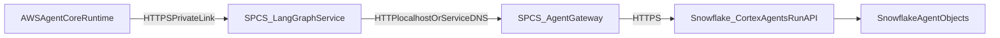

# LangGraph + Snowflake Agent Gateway on Snowpark Container Services (SPCS)

This runbook describes how to:

- Deploy **LangGraph Supervisor** as a **Snowpark Container Services** service.
- Deploy a **Snowflake Agent Gateway** (HTTP API) as either:
  - A second container in the same SPCS service (recommended), or
  - A separate SPCS service.
- Configure **private connectivity** so **AWS AgentCore** can call the LangGraph SPCS endpoint over PrivateLink.
- Build/tag/push Docker images to the **Snowflake image registry** and reference them in Snowflake-standard service specs.

## Architecture (target state)



## References (Snowflake docs)

- Image registry / repositories: `https://docs.snowflake.com/en/developer-guide/snowpark-container-services/working-with-registry-repository`
- Tutorials overview: `https://docs.snowflake.com/en/developer-guide/snowpark-container-services/overview-tutorials`
- Job service example: `https://docs.snowflake.com/en/developer-guide/snowpark-container-services/tutorials/tutorial-2`
- Private connectivity: `https://docs.snowflake.com/en/developer-guide/snowpark-container-services/private-connectivity`
- Service spec reference: `https://docs.snowflake.com/en/developer-guide/snowpark-container-services/specification-reference`
- CREATE SERVICE: `https://docs.snowflake.com/en/sql-reference/sql/create-service`
- SHOW ENDPOINTS: `https://docs.snowflake.com/en/sql-reference/sql/show-endpoints`
- EXECUTE JOB SERVICE (optional): `https://docs.snowflake.com/en/sql-reference/sql/execute-job-service`
- Snowflake CLI registry login: `https://docs.snowflake.com/en/developer-guide/snowflake-cli/command-reference/spcs-commands/image-registry-commands/login`

## Repo artifacts (what this runbook aligns to)

- **LangGraph container**: `docker/langgraph/Dockerfile` (exposes port 8001) + `langgraph/api/main.py` (`/ping`, `/supervisor/process`).
- **Agent Gateway HTTP server**: `snowflake_cortex/gateway/http_server.py` (exposes port 8002) with:
  - `GET /health` (and `/ping`)
  - `POST /agents/invoke`
  - `GET /prompts/{prompt_name}` and `POST /prompts` (Langfuse prompt manager passthrough)
- **Snowflake Cortex Agents Run client**: `snowflake_cortex/gateway/agent_gateway.py` (calls Snowflake `/api/v2/.../agents/{name}:run`).
- **SPCS specs (Snowflake-standard YAML)**: see files in `snowflake/spcs/` created alongside this doc.

## Prerequisites (Snowflake)

- Snowpark Container Services enabled on your account.
- A role with privileges required by Snowflake for services, including at minimum:
  - `CREATE SERVICE` on schema
  - `USAGE` on compute pool
  - `READ` on the stage that stores the spec file
  - `READ` on the image repository referenced by the spec
  - If you declare a **public endpoint**, the service owner role must have `BIND SERVICE ENDPOINT` at account level
  - `READ` on any Snowflake **secrets** referenced from the spec
- Snowflake CLI (`snow`) configured for the account/role you will use.
- Docker installed on the machine that will build/push images.

## Prerequisites (AWS / private connectivity)

This runbook assumes **private connectivity** between AWS and Snowflake.

- Set up inbound private connectivity to your Snowflake account (PrivateLink) and configure DNS as described in:
  `https://docs.snowflake.com/en/developer-guide/snowpark-container-services/private-connectivity`
- You will use `SYSTEM$GET_PRIVATELINK_CONFIG` output to create DNS CNAMEs for:
  - SPCS service public endpoints (`app-service-privatelink-url`)
  - SPCS auth endpoint (`spcs-auth-privatelink-url`)
  - SPCS registry (`spcs-registry-privatelink-url`)

## Step 1 — Create Snowflake “platform” objects (DB/Schema, stage, compute pool, image repo)

Run in Snowflake (example names; adjust to your standards):

```sql
CREATE DATABASE IF NOT EXISTS SPCS_APP_DB;
CREATE SCHEMA IF NOT EXISTS SPCS_APP_DB.SPCS;

-- Stage to store SPCS spec YAMLs
CREATE STAGE IF NOT EXISTS SPCS_APP_DB.SPCS.SPCS_SPECS_STAGE;

-- Image repository to store OCI images (LangGraph, gateway)
CREATE IMAGE REPOSITORY IF NOT EXISTS SPCS_APP_DB.SPCS.APP_REPO;

-- Compute pool for services
CREATE COMPUTE POOL IF NOT EXISTS SPCS_APP_POOL
  MIN_NODES = 1
  MAX_NODES = 2
  INSTANCE_FAMILY = CPU_X64_XS;
```

Notes:
- Image repository hostname/URL format is described here:
  `https://docs.snowflake.com/en/developer-guide/snowpark-container-services/working-with-registry-repository`
- SPCS requires **linux/amd64** images (service spec reference):
  `https://docs.snowflake.com/en/developer-guide/snowpark-container-services/specification-reference`

## Step 2 — Create Snowflake Secrets (recommended)

This runbook uses secrets instead of embedding passwords/tokens in YAML.

### 2.1 LangGraph: Snowflake SQL credentials

If your LangGraph container connects to Snowflake via username/password, store them as a `TYPE=PASSWORD` secret:

```sql
CREATE OR REPLACE SECRET SPCS_APP_DB.SPCS.LANGGRAPH_SF_PASSWORD
  TYPE = PASSWORD
  USERNAME = '<SNOWFLAKE_USER>'
  PASSWORD = '<SNOWFLAKE_PASSWORD>';
```

### 2.2 Gateway: Snowflake REST API token (PAT or OAuth access token)

The gateway client expects `SNOWFLAKE_AUTH_TOKEN` (Bearer token). Store it as a `TYPE=GENERIC_STRING` secret:

```sql
CREATE OR REPLACE SECRET SPCS_APP_DB.SPCS.SNOWFLAKE_AUTH_TOKEN
  TYPE = GENERIC_STRING
  SECRET_STRING = '<PASTE_TOKEN_HERE>';
```

Secret DDL reference: `https://docs.snowflake.com/en/sql-reference/sql/create-secret`

### 2.3 (Optional) Langfuse secrets

If you use Langfuse prompt management, store the secret key and any other sensitive values in secrets as well.

## Step 3 — Build Docker images (linux/amd64) and push to Snowflake registry

Snowflake tutorial pattern uses:
- Build image tagged with the **repository URL** + image name
- Authenticate Docker to Snowflake registry using Snowflake CLI

References:
- Tutorial: `https://docs.snowflake.com/en/developer-guide/snowpark-container-services/tutorials/tutorial-2`
- Registry login: `https://docs.snowflake.com/en/developer-guide/snowflake-cli/command-reference/spcs-commands/image-registry-commands/login`

### 3.1 Login Docker to Snowflake registry

```bash
snow spcs image-registry login
```

If you’re using PrivateLink for the registry, see `--private-link` option in the same doc page.

### 3.2 Get the repository URL

Option A (SQL):

```sql
SHOW IMAGE REPOSITORIES;
```

Option B (Snowflake CLI):

```bash
snow spcs image-repository url --name SPCS_APP_DB.SPCS.APP_REPO
```

### 3.3 Build + push LangGraph image

From repo root:

```bash
REPO_URL="$(snow spcs image-repository url --name SPCS_APP_DB.SPCS.APP_REPO)"

docker build --platform linux/amd64 -f docker/langgraph/Dockerfile -t "$REPO_URL/langgraph:latest" .
docker push "$REPO_URL/langgraph:latest"
```

### 3.4 Build + push Agent Gateway image

```bash
REPO_URL="$(snow spcs image-repository url --name SPCS_APP_DB.SPCS.APP_REPO)"

docker build --platform linux/amd64 -f docker/snowflake-cortex/Dockerfile -t "$REPO_URL/snowflake-cortex:latest" .
docker push "$REPO_URL/snowflake-cortex:latest"
```

## Step 4 — Choose your SPCS deployment topology

### Option A (recommended): one SPCS service with two containers

- One service in one compute pool.
- Two containers share `localhost` network (LangGraph → gateway on `http://localhost:8002`).
- Only LangGraph endpoint needs to be public (for AWS AgentCore ingress via PrivateLink).

Use: `snowflake/spcs/langgraph_with_gateway_spec.yaml`

### Option B: two SPCS services

- `langgraph_service_spec.yaml` for LangGraph.
- `agent_gateway_service_spec.yaml` for the gateway.
- LangGraph calls gateway using service-to-service communication (endpoint stays private).

## Step 5 — Stage the SPCS spec YAML

Upload the spec file(s) to your internal stage (tutorial uses `PUT`):
`https://docs.snowflake.com/en/developer-guide/snowpark-container-services/tutorials/tutorial-2`

Example:

```sql
PUT file://./snowflake/spcs/langgraph_with_gateway_spec.yaml @SPCS_APP_DB.SPCS.SPCS_SPECS_STAGE
  AUTO_COMPRESS = FALSE
  OVERWRITE = TRUE;
```

## Step 6 — Create the SPCS service

Reference syntax:
`https://docs.snowflake.com/en/sql-reference/sql/create-service`

Example (Option A):

```sql
CREATE SERVICE IF NOT EXISTS LANGGRAPH_SPCS
  IN COMPUTE POOL SPCS_APP_POOL
  FROM @SPCS_APP_DB.SPCS.SPCS_SPECS_STAGE
  SPECIFICATION_FILE = 'langgraph_with_gateway_spec.yaml';
```

If you update the spec/image later, use `ALTER SERVICE ... FROM @stage SPECIFICATION_FILE=...`.

## Step 7 — Get the endpoint URL (Public + PrivateLink)

Use:
`https://docs.snowflake.com/en/sql-reference/sql/show-endpoints`

```sql
SHOW ENDPOINTS IN SERVICE LANGGRAPH_SPCS;
```

Look for:
- `ingress_url` (public internet)
- `privatelink_ingress_url` (when available / Business Critical)

## Step 8 — Configure AWS AgentCore to call LangGraph SPCS

Your LangGraph service supports:
- `GET /ping`
- `POST /supervisor/process` (and `/invocations`)

AWS AgentCore should call:

```text
https://<privatelink_ingress_url>/supervisor/process
```

### Where this value lives in this repo

- The default endpoint is configured via `LANGGRAPH_ENDPOINT` (see `.env.example`).
- Settings mapping is in `shared/config/settings.py` under `LangGraphSettings.langgraph_endpoint` (env prefix `LANGGRAPH_`).

Request shape:

```json
{
  "query": "What are total sales for last month?",
  "session_id": "session-123",
  "context": {}
}
```

### AgentCore → LangGraph invocation pattern (HTTP)

In AWS, the AgentCore Runtime (or a Lambda sitting behind API Gateway) typically:

- reads the LangGraph URL from configuration (e.g., `LANGGRAPH_ENDPOINT`)
- calls `POST {LANGGRAPH_ENDPOINT}/supervisor/process` with the JSON payload above
- returns the LangGraph response (or maps it into AgentCore response schema)

## Step 9 — Verify end-to-end

### 9.1 Health checks

- LangGraph:
  - `GET https://<endpoint>/ping`
- Gateway (only if exposed; for Option A it’s internal):
  - `GET http://localhost:8002/health` (from within the service instance)

### 9.2 Invoke an agent

LangGraph will call the gateway at the configured `SNOWFLAKE_CORTEX_AGENT_GATEWAY_ENDPOINT` (for Option A: `http://localhost:8002`).

Gateway will call Snowflake Agents Run API:
- `/api/v2/databases/{db}/schemas/{schema}/agents/{agent_name}:run`
- Or `/api/v2/cortex/agent:run` when using direct mode (see `snowflake_cortex/gateway/agent_gateway.py`)

## Troubleshooting checklist

- **Image reference errors**: confirm repository URL and image tags; see registry/repo docs:
  `https://docs.snowflake.com/en/developer-guide/snowpark-container-services/working-with-registry-repository`
- **Wrong platform**: ensure `--platform linux/amd64` on Docker build:
  `https://docs.snowflake.com/en/developer-guide/snowpark-container-services/specification-reference`
- **403 on endpoint**: public endpoints require `BIND SERVICE ENDPOINT` and proper service role grants.
- **PrivateLink not resolving**: follow DNS requirements from:
  `https://docs.snowflake.com/en/developer-guide/snowpark-container-services/private-connectivity`
- **Service logs/containers**: use `SHOW SERVICE CONTAINERS IN SERVICE ...` and `SYSTEM$GET_SERVICE_LOGS` (see tutorial 2 debugging section):
  `https://docs.snowflake.com/en/developer-guide/snowpark-container-services/tutorials/tutorial-2`

## Appendix — Job services (optional)

If you need one-shot/batch jobs (not LangGraph), see:
- Tutorial: `https://docs.snowflake.com/en/developer-guide/snowpark-container-services/tutorials/tutorial-2`
- SQL: `https://docs.snowflake.com/en/sql-reference/sql/execute-job-service`

## Implementation notes / repo gaps addressed

- The existing file `snowflake/spcs/langgraph_service.yml` is **not** in Snowflake’s standard SPCS service specification format
  (it uses `spec.service.*`). For Snowflake-standard YAML, use the new files in `snowflake/spcs/`:
  - `langgraph_with_gateway_spec.yaml` (recommended)
  - `langgraph_service_spec.yaml`
  - `agent_gateway_service_spec.yaml`
  Reference: `https://docs.snowflake.com/en/developer-guide/snowpark-container-services/specification-reference`
- The repo previously documented a gateway HTTP service on port 8002 but the FastAPI implementation had been removed.
  The gateway HTTP surface required for SPCS is now provided by `snowflake_cortex/gateway/http_server.py` and is reachable via:
  - `python -m snowflake_cortex.gateway` (Docker CMD)
  - `python -m snowflake_cortex.gateway.api`

