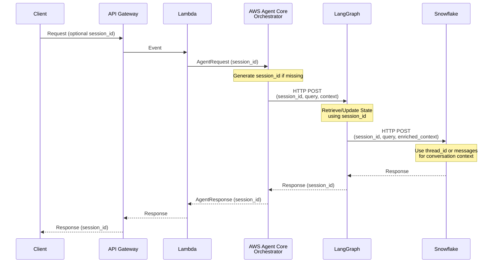
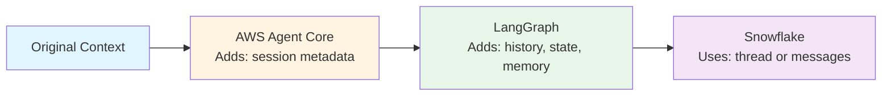
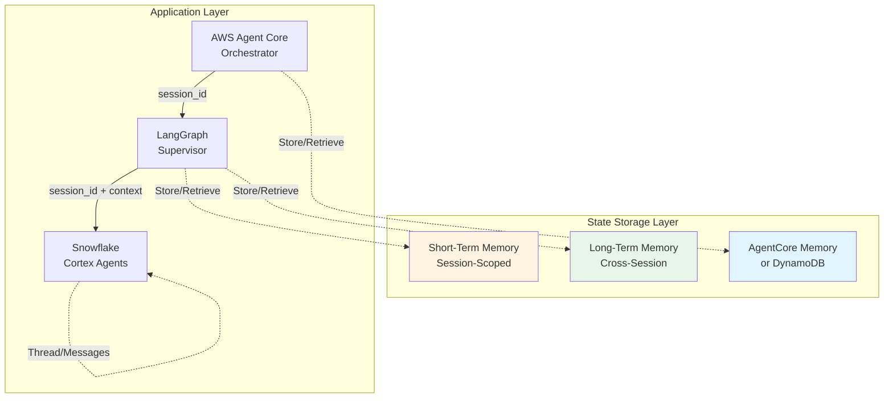
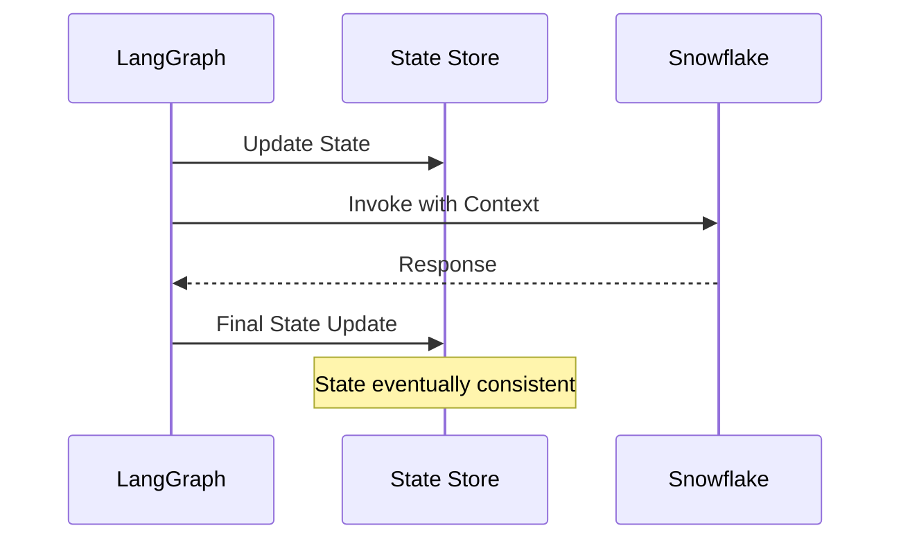

# State and Memory Management Across Multi-Agent Framework

## Executive Summary

This document provides a comprehensive analysis of state and memory management across three frameworks in the multi-agent orchestrator:

1. **AWS Agent Core SDK** - Orchestration layer
2. **LangGraph** - Multi-agent supervisor
3. **Snowflake Cortex Agents** - Specialized data agents

### Key Findings

1. **State is needed at all three levels**, but for different purposes:
   - **AWS Agent Core**: Session management and orchestration-level state
   - **LangGraph**: Workflow state managed via StateGraph pattern, routing decisions, and conversation history
   - **Snowflake**: Conversation threading and query context

2. **Session ID is the primary mechanism** for state correlation across frameworks (used as `thread_id` in StateGraph)

3. **Current implementation uses LangGraph StateGraph** with in-memory state (can add checkpointer for persistent storage)

4. **Historical context can be maintained** through:
   - Short-term memory (within session)
   - Long-term memory (across sessions)
   - Conversation history arrays

### Recommendations

1. **Add checkpointer to StateGraph** for persistent state storage (AgentCore Memory or DynamoDB)
2. **Use consistent session ID** across all three frameworks (as `thread_id` in StateGraph config)
3. **Enrich context at each layer** to pass relevant state downstream (handled by StateGraph nodes)
4. **StateGraph handles state synchronization** automatically through graph execution
5. **Add checkpointer** to StateGraph compilation for production-ready persistent storage

---

## Table of Contents

1. [Current Implementation Analysis](#current-implementation-analysis)
2. [State Management Requirements](#state-management-requirements)
3. [Session Information Flow](#session-information-flow)
4. [Conversation State Maintenance](#conversation-state-maintenance)
5. [Historical Conversation Context](#historical-conversation-context)
6. [Recommended Architecture](#recommended-architecture)
7. [Implementation Examples](#implementation-examples)
8. [Best Practices and Considerations](#best-practices-and-considerations)

---

## Current Implementation Analysis

### AWS Agent Core SDK State Handling

#### Session Management

AWS Agent Core SDK uses `sessionId` parameter in the `invoke_agent()` method to maintain conversation state:

```python
# From aws_agent_core/runtime/sdk_client.py
def invoke_agent(
    self,
    agent_id: str,
    agent_alias_id: str,
    session_id: str,  # Key for state management
    input_text: str,
    enable_trace: bool = True
) -> Dict[str, Any]:
```

**Key Characteristics:**
- Each `sessionId` creates an isolated session in a dedicated microVM
- Sessions persist for up to 8 hours of total runtime
- AWS Agent Core maintains internal state for each session
- State includes conversation history, agent context, and execution state

#### AgentCore Memory Integration

AWS provides **AgentCore Memory** - a fully managed, serverless primitive for state persistence:

- **Short-term memory**: Conversation state within a session
- **Long-term memory**: Cross-session knowledge and context
- **Integration with LangGraph**: Can be used as a checkpoint backend via `langgraph_checkpoint_aws`

**Current Implementation:**
- Currently uses `sessionId` for session correlation
- Does not yet integrate AgentCore Memory (recommended for production)

### LangGraph State Management

#### Current Implementation (StateGraph Pattern)

The current implementation uses **LangGraph's StateGraph** pattern for declarative workflow and state management:

```python
# From langgraph/state/graph_state.py
class SupervisorState(TypedDict):
    """State schema for LangGraph supervisor workflow."""
    query: str
    session_id: str
    messages: List[Dict[str, Any]]  # Conversation history
    plan: Optional[Dict[str, Dict[str, Any]]]
    plan_current_step: Optional[int]
    replan_flag: Optional[bool]
    last_reason: Optional[str]
    replan_attempts: Optional[Dict[int, int]]
    enabled_agents: Optional[List[str]]
    user_query: Optional[str]
    agent_query: Optional[str]
    routing_decision: Optional[Dict[str, Any]]
    agent_responses: List[Dict[str, Any]]
    final_response: Optional[str]
    status: str
    current_step: Optional[str]
    error: Optional[str]
    metadata: Dict[str, Any]
    context: Optional[Dict[str, Any]]
    start_time: Optional[float]
    execution_time: Optional[float]
```

**StateGraph Workflow:**

The supervisor uses a StateGraph with the following nodes:
1. **load_state** - Loads conversation history and initializes state
2. **plan_request** - Planner LLM generates a numbered plan
3. **execute_plan** - Executor LLM selects next agent + query
4. **invoke_agents** - Invokes Snowflake Cortex AI agents
5. **combine_responses** - Combines multiple agent responses
6. **advance_plan** - Advances plan step or triggers replan
7. **update_memory** - Updates conversation history and patterns
8. **log_observability** - Logs to Langfuse
9. **handle_error** - Handles errors via conditional edges

**State Components:**

1. **SupervisorState TypedDict** (`langgraph/state/graph_state.py`):
   - Request information (query, session_id)
   - Conversation history (messages array)
  - Planner/executor plan (plan, plan_current_step, replan flags)
  - Routing decision (agents_to_call, routing_reason, confidence)
   - Agent responses (list of responses from invoked agents)
   - Final response (combined response text)
   - Processing state (status, current_step)
   - Error handling (error message)
   - Metadata and context

2. **Short-Term Memory** (`langgraph/memory/short_term.py`):
   - Session-scoped memory with TTL (default: 1 hour)
   - Stores conversation history, routing decisions
   - Automatically expires entries based on TTL
   - Used by `load_state` and `update_memory` nodes

3. **Long-Term Memory** (`langgraph/memory/long_term.py`):
   - Cross-session memory (no expiration)
   - Stores query patterns, successful routing decisions
   - Supports search functionality
   - Used by `update_memory` node for significant patterns

**Key Benefits:**
- **Automatic State Management**: LangGraph handles state passing between nodes
- **Declarative Workflow**: Graph structure is clear and visualizable
- **Built-in Checkpointing**: Can add checkpointer for persistence without code changes
- **Error Handling**: Conditional edges route to error handler automatically
- **No Manual State Updates**: State is managed by StateGraph, not manual create/update calls

**Current Limitations:**
- In-memory state (lost on restart) - can be addressed by adding checkpointer
- No persistence across service restarts - can add AgentCore Memory or DynamoDB checkpointer
- Not suitable for distributed deployments - can add persistent checkpointer

#### Checkpointing Options

LangGraph supports multiple checkpoint backends:

1. **AgentCore Memory** (Recommended):
   ```python
   from langgraph_checkpoint_aws import AgentCoreMemorySaver
   checkpointer = AgentCoreMemorySaver(memory_id, region_name=REGION)
   graph = graph_builder.compile(checkpointer=checkpointer)
   ```

2. **Redis**:
   ```python
   from langgraph.checkpoint.redis import RedisSaver
   checkpointer = RedisSaver(redis_client)
   ```

3. **PostgreSQL**:
   ```python
   from langgraph.checkpoint.postgres import PostgresSaver
   checkpointer = PostgresSaver(connection_string)
   ```

### Snowflake Cortex Agents State Management

#### Thread-Based State Management

Snowflake Cortex Agents support two approaches for conversation state:

1. **Thread-Based** (Recommended for long conversations):
   ```python
   # From snowflake_cortex/gateway/agent_gateway.py
   if thread_id is not None and parent_message_id is not None:
       body["thread_id"] = int(thread_id)
       body["parent_message_id"] = int(parent_message_id)
       # When using threads, only current message is sent
       body["messages"] = [{"role": "user", "content": [{"type": "text", "text": query}]}]
   ```
   - Snowflake manages conversation history internally
   - Only current message needs to be sent
   - Thread persists conversation context

2. **Message-Based** (For stateless or short conversations):
   ```python
   messages = self._build_messages(query=query, history=history)
   body["messages"] = messages  # Full conversation history
   ```
   - Full conversation history passed in `messages` array
   - Suitable for stateless invocations
   - Requires managing history externally

#### Current Implementation

The gateway supports both approaches:

```python
# From snowflake_cortex/gateway/agent_gateway.py
def _build_messages(self, query: str, history: Optional[List[Dict[str, Any]]]) -> List[Dict[str, Any]]:
    """Convert internal history format into Snowflake 'messages' schema."""
    messages: List[Dict[str, Any]] = []
    if history and isinstance(history, list):
        for msg in history:
            role = msg.get("role")
            content = msg.get("content")
            if role in ("user", "assistant"):
                messages.append({
                    "role": role,
                    "content": [{"type": "text", "text": content}],
                })
    # Ensure current user message is included
    messages.append({"role": "user", "content": [{"type": "text", "text": query}]})
    return messages
```

**Key Characteristics:**
- Supports both thread-based and message-based state
- Automatically converts internal history format to Snowflake format
- Handles conversation context through `context` parameter

### Current State Flow

The current implementation follows this flow:

```
API Gateway / Lambda
    ↓ (session_id, query, context)
AWS Agent Core Orchestrator
    ↓ (session_id, query, context)
LangGraph Supervisor
    ↓ (session_id, enriched_context with history)
Snowflake Cortex Agents
```

**Session ID Propagation:**
1. Generated or received at orchestrator level
2. Passed to LangGraph via HTTP request
3. Used for state retrieval and memory management
4. Passed to Snowflake in context

**Context Enrichment:**
- Each layer enriches context with its own state
- LangGraph adds history, state snapshot, and memory
- Snowflake receives enriched context with full conversation history

---

## State Management Requirements

### Do We Need State at All Three Levels?

**Yes, but for different purposes:**

#### 1. AWS Agent Core SDK Level

**Purpose:**
- Session isolation and orchestration-level state
- Request routing and coordination
- Trace and observability correlation

**What to Store:**
- Session metadata
- Request routing decisions
- Trace IDs and execution context
- Agent invocation history

**Storage Duration:**
- Session-scoped (up to 8 hours)
- Can leverage AgentCore Memory for persistence

#### 2. LangGraph Level

**Purpose:**
- Workflow state management
- Agent routing decisions
- Conversation history within session
- Cross-session patterns and learnings

**What to Store:**
- Agent routing decisions and reasoning
- Conversation history (short-term)
- Query patterns (long-term)
- State transitions and intermediate results

**Storage Duration:**
- Short-term: Session-scoped (TTL-based)
- Long-term: Persistent across sessions

#### 3. Snowflake Level

**Purpose:**
- Query context and conversation threading
- Data query history
- Tool invocation context

**What to Store:**
- Conversation messages (thread-based or message-based)
- Query context and parameters
- Tool execution results

**Storage Duration:**
- Thread-scoped (managed by Snowflake)
- Can persist across multiple invocations

### State Lifecycle and Scope

```
┌─────────────────────────────────────────────────────────────┐
│                    State Lifecycle                            │
├─────────────────────────────────────────────────────────────┤
│                                                               │
│  Request Arrives                                              │
│       ↓                                                       │
│  Session ID Generated/Retrieved                               │
│       ↓                                                       │
│  AWS Agent Core: Create/Retrieve Session State                │
│       ↓                                                       │
│  LangGraph: Retrieve/Update Workflow State                    │
│       ↓                                                       │
│  Snowflake: Create/Continue Thread or Pass Messages          │
│       ↓                                                       │
│  Process Request with Context                                │
│       ↓                                                       │
│  Update State at All Levels                                  │
│       ↓                                                       │
│  Persist State (Short-term and Long-term)                    │
│                                                               │
└─────────────────────────────────────────────────────────────┘
```

---

## Session Information Flow

### Session ID Generation and Propagation

#### Generation Strategy

```python
# From aws_agent_core/orchestrator.py
session_id = request.session_id or f"session_{int(time.time() * 1000)}"
```

**Best Practices:**
1. **Client-provided session ID** (preferred): Allows clients to maintain sessions
2. **Auto-generated session ID**: Fallback for new sessions
3. **Consistent format**: Use UUID or timestamp-based IDs

#### Propagation Flow



### State Passing Mechanisms

#### 1. AWS Agent Core → LangGraph

**Current Implementation:**
```python
# From aws_agent_core/orchestrator.py
async def _invoke_langgraph(
    self,
    request: AgentRequest,
    session_id: str
) -> Dict[str, Any]:
    response = await client.post(
        f"{self.langgraph_endpoint}/supervisor/process",
        json={
            "query": request.query,
            "session_id": session_id,  # Session ID passed
            "context": request.context,  # Context passed
            "agent_preference": request.agent_preference,
        }
    )
```

**State Passed:**
- `session_id`: For state correlation
- `query`: Current user query
- `context`: Additional context from orchestrator
- `agent_preference`: User preference for agent selection

#### 2. LangGraph → Snowflake

**Current Implementation (StateGraph):**
```python
# From langgraph/supervisor/graph.py - invoke_agents node
enriched_context = {
    **context,
    "history": messages[-max_history:],  # Conversation history from state
    "langgraph": {
        "state": {
            "session_id": session_id,
            "status": state.get("status"),
            "current_step": state.get("current_step"),
        },
        "short_term_memory": short_term_memory.get_all(session_id=session_id),
    },
}

# Passed to Snowflake
response = await _invoke_snowflake_agent(
    agent_name=agent_name,
    query=query,
    session_id=session_id,
    context=enriched_context,
)
```

**State Passed:**
- `session_id`: From state["session_id"]
- `query`: From state["query"]
- `history`: From state["messages"] (conversation history)
- `context`: Enriched context with LangGraph state snapshot
- `langgraph.state`: State snapshot (simplified, serializable)
- `langgraph.short_term_memory`: Memory snapshot

#### 3. Snowflake State Management

**Thread-Based Approach:**
```python
# From snowflake_cortex/gateway/agent_gateway.py
if thread_id is not None and parent_message_id is not None:
    body["thread_id"] = int(thread_id)
    body["parent_message_id"] = int(parent_message_id)
    body["messages"] = [{"role": "user", "content": [{"type": "text", "text": query}]}]
```

**Message-Based Approach:**
```python
messages = self._build_messages(query=query, history=history)
body["messages"] = messages  # Full history
```

### Context Enrichment Strategies

Each layer enriches context before passing downstream:



**Enrichment at Each Layer:**

1. **AWS Agent Core**:
   - Session metadata
   - Request tracing information
   - Agent preferences

2. **LangGraph**:
   - Conversation history (bounded window)
   - State snapshot
   - Short-term memory
   - Routing decisions

3. **Snowflake**:
   - Uses enriched context
   - Converts to Snowflake message format
   - Manages thread or message array

---

## Conversation State Maintenance

### Within-Session State (Short-Term)

#### Current Implementation

```python
# From langgraph/memory/short_term.py
class ShortTermMemory:
    def __init__(self, default_ttl: int = 3600):  # 1 hour default
        self.memory: Dict[str, Dict[str, MemoryEntry]] = {}
```

**What is Stored:**
- Conversation history (bounded to 30 messages)
- Last query
- Routing decisions
- Intermediate results

**Storage Mechanism:**
- In-memory dictionary keyed by `session_id`
- TTL-based expiration (default: 1 hour)
- Automatic cleanup of expired entries

**Usage Pattern:**
```python
# Store conversation history
short_term_memory.store(
    session_id=session_id,
    key="history",
    value=history[-max_history:],  # Bounded window
)

# Retrieve for context
history = short_term_memory.retrieve(session_id=session_id, key="history") or []
```

#### Recommended Improvements

1. **Persistent Storage**: Migrate to Redis or DynamoDB
2. **Configurable TTL**: Per-key TTL configuration
3. **State Compression**: Compress large history arrays
4. **Distributed Access**: Support for multiple LangGraph instances

### Cross-Session State (Long-Term)

#### Current Implementation

```python
# From langgraph/memory/long_term.py
class LongTermMemory:
    def __init__(self):
        self.memory: Dict[str, MemoryEntry] = {}  # No expiration
```

**What is Stored:**
- Query patterns
- Successful routing decisions
- User preferences
- Learned patterns

**Storage Mechanism:**
- In-memory dictionary (no expiration)
- Search functionality for pattern matching
- Metadata for categorization

**Usage Pattern:**
```python
# Store significant patterns
if routing_decision.get("confidence", 0) > 0.8:
    long_term_memory.store(
        key=f"query_pattern_{session_id}",
        value={
            "query": request.query,
            "agent": routing_decision["selected_agent"].value,
            "success": True
        }
    )

# Search for patterns
results = long_term_memory.search(query="sales data", limit=5)
```

#### Recommended Improvements

1. **Vector Search**: Use embeddings for semantic search
2. **Persistent Storage**: DynamoDB or AgentCore Memory
3. **Categorization**: Tag-based organization
4. **Analytics**: Track pattern usage and effectiveness

### State Persistence Strategies

#### Option 1: AWS AgentCore Memory (Recommended)

**Benefits:**
- Fully managed, serverless
- Native integration with AWS Agent Core
- Supports both short-term and long-term memory
- Vector search capabilities

**Implementation:**
```python
from langgraph_checkpoint_aws import AgentCoreMemorySaver

# Initialize checkpointer
checkpointer = AgentCoreMemorySaver(
    memory_id="your-memory-id",
    region_name="us-east-1"
)

# Use with LangGraph
graph = graph_builder.compile(checkpointer=checkpointer)
```

#### Option 2: DynamoDB

**Benefits:**
- Fully managed NoSQL database
- Scalable and durable
- TTL support for automatic expiration
- Cost-effective

**Implementation:**
```python
import boto3
from langgraph.checkpoint.dynamodb import DynamoDBSaver

dynamodb = boto3.resource('dynamodb')
table = dynamodb.Table('langgraph-state')

checkpointer = DynamoDBSaver(table)
graph = graph_builder.compile(checkpointer=checkpointer)
```

#### Option 3: Redis

**Benefits:**
- High performance
- Built-in TTL support
- Pub/sub for state synchronization
- Suitable for high-throughput scenarios

**Implementation:**
```python
from langgraph.checkpoint.redis import RedisSaver
import redis

redis_client = redis.Redis(host='localhost', port=6379)
checkpointer = RedisSaver(redis_client)
graph = graph_builder.compile(checkpointer=checkpointer)
```

### State Retrieval and Restoration

#### Retrieval Pattern (StateGraph)

```python
# From langgraph/supervisor/graph.py - load_state node
async def load_state(state: SupervisorState) -> SupervisorState:
    """Load state and conversation history."""
    session_id = state["session_id"]
    query = state["query"]
    
    # Retrieve prior conversation history
    history = short_term_memory.retrieve(session_id=session_id, key="history") or []
    
    # Append current user message
    history.append({
        "role": "user",
        "content": query,
        "ts": time.time(),
    })
    
    # Update state (automatic via StateGraph)
    state["messages"] = history
    state["status"] = "processing"
    state["start_time"] = time.time()
    
    return state
```

**Note:** State is automatically managed by LangGraph StateGraph. No manual `get_state()` or `create_state()` calls needed.

#### Restoration Strategy

1. **On Request Arrival**:
   - Retrieve session state using `session_id`
   - Load conversation history
   - Restore routing preferences

2. **State Validation**:
   - Check state freshness (TTL)
   - Validate state structure
   - Handle missing or corrupted state

3. **State Update**:
   - Update state with new information
   - Persist changes immediately
   - Maintain state consistency

---

## Historical Conversation Context

### Using Past Conversations Within a Session

#### Current Implementation

```python
# From langgraph/supervisor.py
# Retrieve prior conversation history
history = short_term_memory.retrieve(session_id=session_id, key="history") or []

# Append current message
history.append({
    "role": "user",
    "content": request.query,
    "ts": time.time(),
})

# Bounded window to avoid unbounded growth
max_history = 30  # messages
short_term_memory.store(
    session_id=session_id,
    key="history",
    value=history[-max_history:],
)
```

**Key Features:**
- Bounded window (30 messages) to manage memory
- Includes both user and assistant messages
- Timestamped for ordering
- Passed to downstream agents in context

#### Context Window Management

**Strategies:**

1. **Fixed Window** (Current):
   - Keep last N messages
   - Simple and predictable
   - May lose important early context

2. **Sliding Window with Summarization**:
   - Keep recent messages in full
   - Summarize older messages
   - Preserves important context

3. **Relevance-Based Selection**:
   - Select messages based on relevance to current query
   - Use embeddings for semantic similarity
   - More intelligent context selection

### Using Past Conversations Across Sessions

#### Long-Term Memory Search

```python
# From langgraph/memory/long_term.py
def search(
    self,
    query: str,
    limit: int = 10
) -> List[Dict[str, Any]]:
    """Search long-term memory by query."""
    # Simple keyword search (can be enhanced with vector search)
    results = []
    for key, entry in self.memory.items():
        if query_lower in key.lower() or query_lower in str(entry.value).lower():
            results.append({
                "key": key,
                "value": entry.value,
                "metadata": entry.metadata,
                "timestamp": entry.timestamp.isoformat()
            })
    return results[:limit]
```

#### Cross-Session Context Retrieval

**Pattern:**
1. **User Identification**: Use user ID or session pattern
2. **Pattern Matching**: Search long-term memory for relevant patterns
3. **Context Enrichment**: Add retrieved patterns to current context
4. **Personalization**: Use historical preferences and patterns

**Example:**
```python
# Search for user's previous query patterns
user_patterns = long_term_memory.search(
    query=f"user_{user_id}",
    limit=5
)

# Enrich context with historical patterns
enriched_context = {
    **current_context,
    "historical_patterns": user_patterns,
    "user_preferences": extract_preferences(user_patterns)
}
```

### Long-Term Memory Search and Retrieval

#### Current Implementation

**Simple Keyword Search:**
```python
# From langgraph/memory/long_term.py
def search(self, query: str, limit: int = 10) -> List[Dict[str, Any]]:
    query_lower = query.lower()
    results = []
    for key, entry in self.memory.items():
        if query_lower in key.lower() or query_lower in str(entry.value).lower():
            results.append({...})
    return results[:limit]
```

#### Recommended Enhancements

1. **Vector Search**:
   ```python
   from langchain.vectorstores import VectorStore
   
   # Create embeddings for memory entries
   embeddings = embed_memory_entries(memory_entries)
   
   # Search using vector similarity
   results = vector_store.similarity_search(query, k=limit)
   ```

2. **Metadata Filtering**:
   ```python
   def search(
       self,
       query: str,
       filters: Dict[str, Any] = None,
       limit: int = 10
   ) -> List[Dict[str, Any]]:
       # Filter by metadata (user_id, agent_type, etc.)
       filtered_entries = apply_filters(memory_entries, filters)
       # Then search
   ```

3. **Temporal Relevance**:
   ```python
   # Weight recent entries higher
   results.sort(
       key=lambda x: (
           relevance_score(x, query),
           -time_since_creation(x)  # Negative for recency
       ),
       reverse=True
   )
   ```

### Context Window Management

#### Strategies

1. **Token-Based Limiting**:
   ```python
   def truncate_history(history: List[Dict], max_tokens: int = 4000):
       """Truncate history to fit within token limit."""
       total_tokens = 0
       truncated = []
       for msg in reversed(history):
           msg_tokens = count_tokens(msg["content"])
           if total_tokens + msg_tokens > max_tokens:
               break
           truncated.insert(0, msg)
           total_tokens += msg_tokens
       return truncated
   ```

2. **Summarization**:
   ```python
   def summarize_old_messages(old_messages: List[Dict]) -> str:
       """Summarize messages beyond window."""
       summary = llm.summarize(
           "\n".join([msg["content"] for msg in old_messages])
       )
       return summary
   ```

3. **Relevance-Based Selection**:
   ```python
   def select_relevant_messages(
       query: str,
       history: List[Dict],
       limit: int = 10
   ) -> List[Dict]:
       """Select most relevant messages to current query."""
       query_embedding = embed(query)
       message_scores = [
           (msg, cosine_similarity(query_embedding, embed(msg["content"])))
           for msg in history
       ]
       message_scores.sort(key=lambda x: x[1], reverse=True)
       return [msg for msg, score in message_scores[:limit]]
   ```

---

## Recommended Architecture

### Unified State Management Approach



### State Storage Recommendations

#### Production Architecture

```
┌─────────────────────────────────────────────────────────────┐
│                    State Storage Strategy                      │
├─────────────────────────────────────────────────────────────┤
│                                                               │
│  AWS Agent Core Level:                                        │
│  └─ AgentCore Memory (or DynamoDB)                          │
│     ├─ Session metadata                                       │
│     ├─ Request routing history                                │
│     └─ Trace correlation                                       │
│                                                               │
│  LangGraph Level:                                             │
│  ├─ Short-Term: Redis or DynamoDB (with TTL)                 │
│  │  ├─ Conversation history (bounded)                         │
│  │  ├─ Routing decisions                                      │
│  │  └─ Intermediate results                                   │
│  └─ Long-Term: DynamoDB or AgentCore Memory                  │
│     ├─ Query patterns                                         │
│     ├─ User preferences                                       │
│     └─ Learned patterns                                       │
│                                                               │
│  Snowflake Level:                                             │
│  └─ Thread-based (managed by Snowflake)                     │
│     ├─ Conversation messages                                  │
│     └─ Query context                                          │
│                                                               │
└─────────────────────────────────────────────────────────────┘
```

### State Synchronization Patterns

#### Pattern 1: Eventual Consistency



#### Pattern 2: Optimistic Locking

```python
# Example: Optimistic locking for state updates
def update_state_with_lock(session_id: str, update: Dict):
    state = get_state(session_id)
    version = state.get("version", 0)
    
    # Update with version check
    result = state_store.update_item(
        Key={"session_id": session_id},
        UpdateExpression="SET ...",
        ConditionExpression="version = :version",
        ExpressionAttributeValues={":version": version}
    )
    
    if result:
        state["version"] += 1
    else:
        raise StateConflictError("State was modified concurrently")
```

#### Pattern 3: State Snapshots

```python
# Create state snapshot before passing downstream
def create_state_snapshot(state: AgentState) -> Dict[str, Any]:
    """Create serializable snapshot of state."""
    return {
        "session_id": state.session_id,
        "selected_agent": state.selected_agent.value if state.selected_agent else None,
        "routing_reason": state.routing_reason,
        "status": state.status.value,
        "current_step": state.current_step,
        "timestamp": state.updated_at.isoformat(),
    }
```

### Migration Path from Current Implementation

#### Phase 1: Add Persistent Storage

1. **Choose Storage Backend**:
   - Option A: AgentCore Memory (recommended for AWS-native)
   - Option B: DynamoDB (flexible and scalable)
   - Option C: Redis (high performance)

2. **Implement Checkpointer**:
   ```python
   # In langgraph/supervisor/graph.py - create_supervisor_graph()
   from langgraph_checkpoint_aws import AgentCoreMemorySaver
   
   def create_supervisor_graph() -> StateGraph:
       workflow = StateGraph(SupervisorState)
       # ... add nodes and edges ...
       
       # Add checkpointer for persistence
       checkpointer = AgentCoreMemorySaver(
           memory_id=settings.agentcore_memory_id,
           region_name=settings.aws_region
       )
       
       # Compile with checkpointer
       graph = workflow.compile(checkpointer=checkpointer)
       return graph
   ```

3. **StateGraph automatically handles state persistence**:
   - No need to modify state manager
   - State is automatically saved/loaded by LangGraph
   - Checkpointer handles all persistence logic

#### Phase 2: Migrate Memory Storage

1. **Short-Term Memory**:
   - Migrate to Redis with TTL
   - Or DynamoDB with TTL attribute

2. **Long-Term Memory**:
   - Migrate to DynamoDB
   - Add vector search capability
   - Implement metadata indexing

#### Phase 3: Enhance State Flow

1. **State Enrichment**:
   - Add state snapshots to context
   - Include historical patterns
   - Add user preferences

2. **State Synchronization**:
   - Implement optimistic locking
   - Add conflict resolution
   - Ensure eventual consistency

#### Phase 4: Production Hardening

1. **Monitoring**:
   - Track state access patterns
   - Monitor state size and growth
   - Alert on state corruption

2. **Performance**:
   - Implement caching layer
   - Optimize state retrieval
   - Batch state updates

---

## Implementation Examples

### Code Snippets for State Passing

#### Example 1: Complete State Flow

```python
# 1. AWS Agent Core Orchestrator
async def process_request(self, request: AgentRequest) -> AgentResponse:
    session_id = request.session_id or generate_session_id()
    
    # Pass to LangGraph
    langgraph_response = await self._invoke_langgraph(
        request=request,
        session_id=session_id
    )
    return AgentResponse(
        response=langgraph_response["response"],
        session_id=session_id,
        ...
    )

# 2. LangGraph Supervisor (StateGraph)
async def process_request(self, request: AgentRequest, session_id: str):
    # Convert to initial state
    initial_state = {
        "query": request.query,
        "session_id": session_id,
        "messages": [],
        "status": "processing",
        # ... other fields
    }
    
    # Invoke StateGraph
    config = {"configurable": {"thread_id": session_id}}
    result = await self.graph.ainvoke(initial_state, config=config)
    
    # StateGraph nodes handle:
    # - load_state: Retrieves history from short_term_memory
    # - plan_request: Planner LLM generates numbered plan
    # - execute_plan: Executor LLM selects next agent + query
    # - invoke_agents: Calls Snowflake with enriched context
    # - combine_responses: Combines agent responses
    # - advance_plan: Moves to next step or replans
    # - update_memory: Updates history and patterns
    # - log_observability: Logs to Langfuse
    
    return self._format_response(result)

# 3. Snowflake Gateway
async def invoke_agent(self, agent_name: str, query: str, session_id: str, context: Dict):
    history = context.get("history", [])
    
    # Convert to Snowflake format
    messages = self._build_messages(query=query, history=history)
    
    # Use thread-based or message-based
    if context.get("thread_id"):
        body = {
            "thread_id": context["thread_id"],
            "parent_message_id": context["parent_message_id"],
            "messages": [{"role": "user", "content": [{"type": "text", "text": query}]}]
        }
    else:
        body = {"messages": messages}
    
    return await self._post_sse(url, body)
```

#### Example 2: State Persistence with AgentCore Memory

```python
from langgraph_checkpoint_aws import AgentCoreMemorySaver
from langgraph.graph import StateGraph

# Initialize checkpointer
checkpointer = AgentCoreMemorySaver(
    memory_id="your-memory-id",
    region_name="us-east-1"
)

# Build graph with checkpointer
graph_builder = StateGraph(AgentState)
# ... add nodes and edges ...
graph = graph_builder.compile(checkpointer=checkpointer)

# Use graph with session
config = {"configurable": {"thread_id": session_id}}
result = graph.invoke(
    {"query": query, "session_id": session_id},
    config=config
)
```

#### Example 3: Historical Context Retrieval (StateGraph)

```python
# In load_state node (langgraph/supervisor/graph.py)
async def load_state(state: SupervisorState) -> SupervisorState:
    """Load state and conversation history."""
    session_id = state["session_id"]
    query = state["query"]
    
    # Short-term: Current session history
    history = short_term_memory.retrieve(
        session_id=session_id,
        key="history"
    ) or []
    
    # Long-term: Search for relevant patterns (optional, can be added)
    # user_patterns = long_term_memory.search(query=query, limit=5)
    
    # Append current user message
    history.append({
        "role": "user",
        "content": query,
        "ts": time.time(),
    })
    
    # Update state with history
    state["messages"] = history
    state["status"] = "processing"
    
    return state
```

### State Persistence Implementations

#### DynamoDB Implementation

```python
import boto3
from datetime import datetime, timedelta

class DynamoDBStateManager:
    def __init__(self, table_name: str):
        self.dynamodb = boto3.resource('dynamodb')
        self.table = self.dynamodb.Table(table_name)
    
    def store_state(self, session_id: str, state: Dict[str, Any], ttl: int = None):
        item = {
            "session_id": session_id,
            "state": state,
            "updated_at": datetime.utcnow().isoformat(),
        }
        
        if ttl:
            item["ttl"] = int((datetime.utcnow() + timedelta(seconds=ttl)).timestamp())
        
        self.table.put_item(Item=item)
    
    def retrieve_state(self, session_id: str) -> Optional[Dict[str, Any]]:
        response = self.table.get_item(Key={"session_id": session_id})
        if "Item" in response:
            return response["Item"].get("state")
        return None
```

#### Redis Implementation

```python
import redis
import json
from typing import Optional

class RedisStateManager:
    def __init__(self, redis_client: redis.Redis):
        self.redis = redis_client
    
    def store_state(self, session_id: str, state: Dict[str, Any], ttl: int = 3600):
        key = f"state:{session_id}"
        self.redis.setex(
            key,
            ttl,
            json.dumps(state)
        )
    
    def retrieve_state(self, session_id: str) -> Optional[Dict[str, Any]]:
        key = f"state:{session_id}"
        data = self.redis.get(key)
        if data:
            return json.loads(data)
        return None
```

### Historical Context Retrieval Examples

#### Example: Cross-Session Pattern Matching

```python
def get_user_context(user_id: str, current_query: str) -> Dict[str, Any]:
    """Retrieve relevant context from user's history."""
    
    # Search long-term memory for user patterns
    patterns = long_term_memory.search(
        query=f"user_{user_id}",
        limit=10
    )
    
    # Find similar queries
    similar_queries = [
        p for p in patterns
        if similarity_score(p["value"]["query"], current_query) > 0.7
    ]
    
    # Extract preferences
    preferred_agents = {}
    for pattern in patterns:
        agent = pattern["value"].get("agent")
        preferred_agents[agent] = preferred_agents.get(agent, 0) + 1
    
    return {
        "similar_queries": similar_queries,
        "preferred_agents": preferred_agents,
        "query_patterns": patterns[:5]
    }
```

---

## Best Practices and Considerations

### Performance Implications

#### State Retrieval Optimization

1. **Caching** (StateGraph handles this automatically):
   ```python
   # StateGraph with checkpointer automatically caches state
   # No manual caching needed - LangGraph handles it
   graph = workflow.compile(checkpointer=checkpointer)
   ```

2. **Batch Operations** (via checkpointer):
   ```python
   # Checkpointer (e.g., AgentCore Memory) handles batch operations
   # StateGraph automatically uses checkpointer for state retrieval
   ```

3. **Lazy Loading** (StateGraph loads state on demand):
   ```python
   # StateGraph loads state automatically when graph is invoked
   # State is loaded from checkpointer based on thread_id
   config = {"configurable": {"thread_id": session_id}}
   result = await graph.ainvoke(initial_state, config=config)
   ```

#### State Size Management

1. **Compression**:
   ```python
   import gzip
   import json
   
   def compress_state(state: Dict) -> bytes:
       return gzip.compress(json.dumps(state).encode())
   ```

2. **Selective Storage**:
   ```python
   # Store only essential state
   essential_state = {
       "session_id": state.session_id,
       "selected_agent": state.selected_agent,
       "status": state.status,
   }
   ```

3. **State Cleanup** (via checkpointer):
   ```python
   # Checkpointer handles state cleanup automatically
   # For AgentCore Memory: TTL-based cleanup
   # For DynamoDB: Use TTL attribute
   # For Redis: Use TTL expiration
   # No manual cleanup needed - handled by checkpointer
   ```

### Security Considerations

#### State Isolation

1. **Session Isolation**:
   - Ensure states are isolated by session_id
   - Validate session ownership
   - Prevent cross-session access

2. **Data Encryption**:
   ```python
   # Encrypt sensitive state data
   from cryptography.fernet import Fernet
   
   def encrypt_state(state: Dict) -> bytes:
       key = get_encryption_key()
       f = Fernet(key)
       return f.encrypt(json.dumps(state).encode())
   ```

3. **Access Control**:
   ```python
   # Validate user access to session
   def validate_session_access(user_id: str, session_id: str) -> bool:
       session_owner = get_session_owner(session_id)
       return session_owner == user_id
   ```

#### PII Handling

1. **PII Detection and Masking**:
   ```python
   def mask_pii_in_state(state: Dict) -> Dict:
       """Mask personally identifiable information."""
       masked_state = state.copy()
       if "user_email" in masked_state:
           masked_state["user_email"] = mask_email(masked_state["user_email"])
       return masked_state
   ```

2. **State Retention Policies**:
   - Define retention periods for different state types
   - Automatically delete expired states
   - Comply with data protection regulations

### Scalability Concerns

#### Distributed State Management

1. **State Partitioning**:
   ```python
   # Partition states by session_id hash
   def get_state_partition(session_id: str) -> str:
       partition = hash(session_id) % num_partitions
       return f"partition_{partition}"
   ```

2. **Replication Strategy**:
   - Use DynamoDB global tables for multi-region
   - Implement Redis cluster for high availability
   - Consider eventual consistency trade-offs

3. **Load Balancing**:
   - Distribute state access across multiple instances
   - Use consistent hashing for session routing
   - Implement state affinity for performance

#### State Synchronization

1. **Event-Driven Updates** (StateGraph with custom node):
   ```python
   # Add custom node to StateGraph for event publishing
   async def publish_state_update(state: SupervisorState) -> SupervisorState:
       """Publish state update to event stream."""
       event_stream.publish({
           "event_type": "state_updated",
           "session_id": state["session_id"],
           "update": state
       })
       return state
   
   # Add to workflow
   workflow.add_node("publish_update", publish_state_update)
   ```

2. **Conflict Resolution**:
   ```python
   # Resolve concurrent state updates
   def resolve_state_conflict(
       current_state: Dict,
       incoming_state: Dict
   ) -> Dict:
       # Use last-write-wins or merge strategy
       return merge_states(current_state, incoming_state)
   ```

### Cost Implications

#### Storage Costs

1. **DynamoDB**:
   - On-demand: Pay per request
   - Provisioned: Reserved capacity
   - Consider TTL for automatic cleanup

2. **AgentCore Memory**:
   - Pay per memory operations
   - Storage costs for persisted state
   - Consider memory lifecycle management

3. **Redis**:
   - Instance-based pricing
   - Consider ElastiCache for managed service
   - Monitor memory usage

#### Optimization Strategies

1. **State Compression**:
   - Reduce storage footprint
   - Lower transfer costs
   - Trade-off: CPU for compression/decompression

2. **Selective Persistence**:
   - Only persist essential state
   - Use TTL for automatic cleanup
   - Archive old states to cheaper storage

3. **Caching Strategy**:
   - Cache frequently accessed states
   - Reduce read operations
   - Balance consistency vs. performance

---

## Conclusion

### Summary

State and memory management across AWS Agent Core SDK, LangGraph, and Snowflake Cortex Agents requires a multi-layered approach:

1. **Session ID** is the primary correlation mechanism
2. **State is needed at all three levels** for different purposes
3. **Context enrichment** at each layer enables downstream agents to have full context
4. **Persistent storage** is essential for production deployments
5. **Historical context** can be leveraged through short-term and long-term memory

### Key Takeaways

- ✅ Use consistent `session_id` across all frameworks
- ✅ Enrich context at each layer before passing downstream
- ✅ Implement persistent storage (AgentCore Memory or DynamoDB)
- ✅ Use bounded windows for conversation history
- ✅ Leverage long-term memory for cross-session patterns
- ✅ Consider thread-based state for Snowflake long conversations
- ✅ Implement state synchronization patterns for consistency

### Next Steps

1. **Phase 1**: Implement persistent storage for LangGraph state
2. **Phase 2**: Migrate memory storage to DynamoDB or Redis
3. **Phase 3**: Integrate AgentCore Memory for unified state management
4. **Phase 4**: Enhance historical context retrieval with vector search
5. **Phase 5**: Implement state synchronization and conflict resolution

---

**Last Updated**: 2024  
**Document Version**: 1.0  
**Author**: Multi-Agent Orchestrator Team
